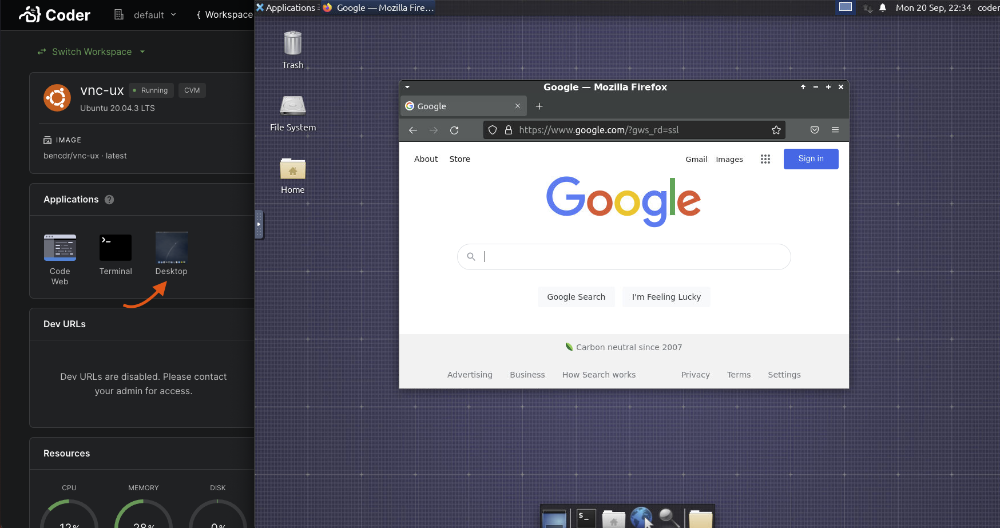

# VNC in Coder

A [sample image](https://github.com/cdr/enterprise-images/tree/main/images/vnc)
for Coder that uses [noVNC](https://github.com/novnc/noVNC) as the client and
[TigerVNC](https://tigervnc.org) as the server. You can find it on
[Dockerhub](https://hub.docker.com/r/codercom/enterprise-vnc).

## To connect

- Option 1 (Web): Click the "Desktop" application from the Coder dashboard on
  any workspace that uses this VNC image.

  

- Option 2 (SSH Tunneling): Connect from your local VNC Client. Expose the VNC
  server to your local machine. You will need the
  [coder-cli](https://github.com/cdr/coder-cli) and any VNC client installed on
  your local machine.

  ```sh
  coder config-ssh
  # Forward the remote VNC server to your local machine
  coder tunnel vnc-ux 5990 5990
  # You will not see any output if it succeeds, but you
  # will be able to connect your VNC client to localhost:5990
  ```

- Option 3 (Web): Create a dev URL on port `6081` and navigate to it
